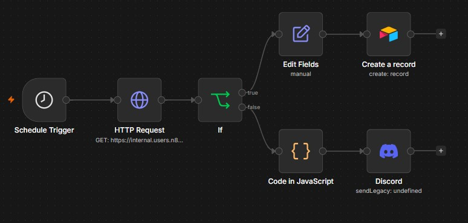

#  n8n Workflows 

## How to Use These Workflows

1. Download the desired `.json` file. 
2. Open your n8n instance. 
3. Create a new empty workflow > *Import from File* (or simply copy the JSON text and paste it directly onto your n8n canvas).

**Important Note:** All sensitive data (such as API keys, credentials, and specific database IDs) has been removed and replaced with placeholders. Make sure to configure your own credentials before running the workflow.

## Workflow Overviews 

### n8n Course level 1: 'Nathan's workflow'

Contains the workflow and assets from the official [n8n Academy - Beginner Course (Level 1)](https://docs.n8n.io/courses/level-one/).

The goal of this workflow is to **automate data processing** and **notifications**. 

It triggers every Monday at a specific time > fetches user data via an **HTTP Request** > 
filters it based on specific criteria using an **If-node** > and then branches out to either populate an **Airtable** database or send an alert to a **Discord** channel.

<b>Steps and goals</b>

To successfully complete this scenario, the workflow achieved the following goals:

* Get the relevant data (*orderID*, *orderStatus*, *orderValue*, *employeeName*) from the data warehouse.
* Filter the orders by their status (*Processing* or *Booked*).
* Calculate the total value of all the booked orders.
* Notify the team members about the Booked orders in the company's Discord channel.
* Insert the details about the processing orders in Airtable for follow-up.
* Schedule this workflow to run every Monday morning.

